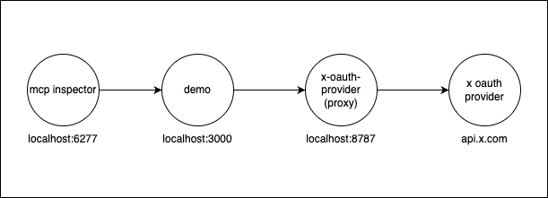

This demo exposes an MCP that uses X as OAuth Provider without having to configure any environment variables, and without having to pre-register any clients.

It can be tested locally:

- In `x-oauth-provider`, run `wrangler dev --env localhost` (exposes x oauth provider proxy on port 8787)
- Here, first `cp .env.example .env`; then, run `wrangler dev` to expose the MCP at http://localhost:3000/mcp
- In a third terminal, run `npx @modelcontextprotocol/inspector` to open the MCP inspector.

DEMO:

# TODO

# Fix MCP login

✅ Added ability to develop `simplerauth-client` + `x-oauth-provider` on localhost (refactor secure flag and url.origin)

✅ Moved everything into the universal-mcp-oauth repo. removed https://github.com/janwilmake/simplerauth.cloudflare for now!

🤔 Now, simplerauth-client successfully works as client, but also must be a valid provider for an MCP server! This part is still untested and we must be able to test this **fully locally**. The provider will be at http://localhost:3000

✅ Create demo that uses `x-oauth-provider`, `simplerauth-client` and `with-mcp`, then test this with `npx @modelcontextprotocol/inspector` fully locally.

Successfully go through Entire OAuth flow with:

- ✅ mcp inspector
- mcp-client-server-registration (make simple UI that also works locally)
- deploy it all, then try at Claude.ai

❗️ Now, I'm getting: `{"error":"invalid_token","error_description":"Token not found or expired"}` for `/authorize` if done from https://mcp.p0web.com. Am I calling the endpoint correctly? Go over the code here. Let's look in the database if things are done correctly and if every error is logged.

After it works, deploy Markdownfeed MCP, Curl MCP, OpenAPI MCP Server with these new versions.

🔥🔥🔥🔥 After I have this.... I can finally ship MCPs with login. Add `withMcp` to `flaredream-user-worker` and start shipping `agent-friendly` workers. 🔥🔥🔥🔥

# Create X MCP?

Using [live search](https://docs.x.ai/docs/guides/live-search) is possible: https://x.com/janwilmake/status/1964663032631431556?

Otherwise, we're stuck with $200/month limit and may need to discontinue that at a later point due to excessive cost.

Other option is go down the path of https://twitterapi.io

Other option is https://scrapecreators.com/twitter-api but only returns top 100 most popular tweets it says

Other option is using SERPER and date filters.

OR FIND BETTER REDDIT MCP.
