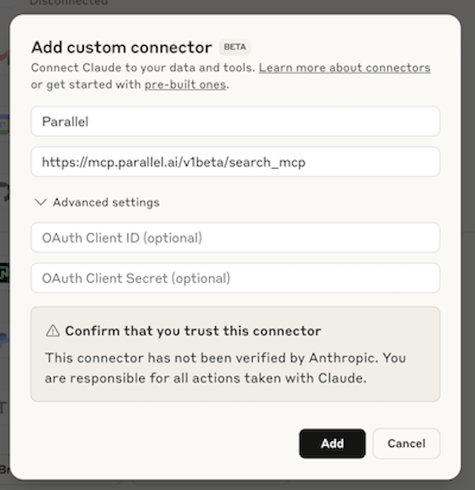
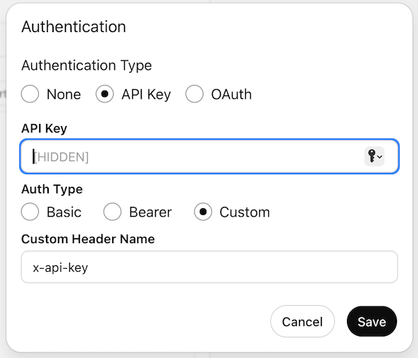

# Creating integrations for your startup - Building 'Login with Parallel'

Since a few weeks I've been working with the team at [Parallel Web Systems](https://parallel.ai) to improve their DX and inspire others to build with Parallel. A few weeks after I started, after 1.5 years of building with early customers, Parallel [launched publicly](https://parallel.ai/blog/introducing-parallel). Their APIs show a new direction for generative AI that I'm very excited about: lowering the bar for high-quality data generation by researching the web agenticly, at scale.

One of my goals is to improve accessibility to Parallel. Their API is very well built and documented, but there aren't many third party apps that integrate with Parallel yet. When I started working with them, the team shared me a document with potential integrations we can create. Platforms like [n8n](https://n8n.io), [poe](https://poe.com), [Composio](https://composio.dev), [LangChain](https://langchain.com), [Zapier](https://zapier.com), and [CrewAI](https://crewai.com) would all benefit from having an integration with Parallel, and Parallel would be adopted faster.

What is a good strategy for building integrations? Should we build all these integrations ourselves? I don't think so, let me explain why. First of all, it feels unauthentic building out integrations for platforms that I don't use myself, that I don't even know anyone from building or using it. This is a problem. Secondly, there's a lot of boilerplate for each of these integrations that I feel like can be shared because it is required for each. That's why, naturally I felt like we should focus on making making integrations easier, so that ultimately, rather than having to make all integrations ourselves, the community would be able to build and maintain these third party integrations themselves.

In the end, the API product of Parallel is most important to be of high quality, if that's the case, others will want to build integrations. We just gotta enable them!

# Why 'Login with Parallel'?

So this is the main reason that naturally led me to OAuth. Because building an integration that uses the API of Parallel is one thing, but having that integration be easy to use takes more than just doing a 1:1 mapping with the APIs to some SDK. The crux to accessibility in most cases for GOOD integrations, in my humble opinion, is most definitely creating an OAuth Provider.

## Ease of use

I'll demonstrate the ease of use with the a few examples

**Example 1: Claude MCPs**

For example, imagine a developer is interested in the [Parallel Search MCP](https://parallel.ai/blog/search-mcp-server) for daily use, or to make an integration with their own AI app. First he/she wants to test it: They use [Claude](https://claude.ai) day to day and want to add it there to see the responsiveness and quality on their intended usecase. As of now, this isn't even possible! Claude only works with MCPs that have OAuth.

**Example 2: ChatGPT GPTs**

Now imagine integrating a custom app that uses the Parallel API with [ChatGPT GPTs](https://chatgpt.com/gpts). When adding an action, it looks like this:

The problem? This doesn't allow to have different API keys for different users. Not possible! Every user needs to go through this tiresome process of creating their own GPTs, but they can't use GPTs that others built, because they would never share it if it uses their own Parallel API key. To make it possible to share, we need oauth, so other apps can make requests to the parallel APIs on behalf of users.

**Example 3: Automations with Zapier**

Now imagine a developer that uses Zapier and wants to build an integration with Parallel. The best he can do right now would be creating an integration where the end-user of the integration needs to:

1. click 'add integration'
2. register to parallel
3. find settings and the default api key
4. copy it
5. paste in the integration dialog, and continue

However, Zapier also [supports Oauth](https://docs.zapier.com/platform/build/oauth). With OAuth, an end user using Parallel in their automation would have a much better flow:

1. click 'add integration'
2. login with parallel (login with google first, then select an API key from available keys) and grant Zapier access.
3. done

Other no-code and low-code platforms such as [Make](https://make.com), [n8n](https://n8n.io), etc, all work in similar ways. This is a huge difference in end-user user-experience, and for external developers, it's currently not possible to build such an expeirience.

**Example 4: Trying out a Github repo using Parallel's API**

Last but not least; imagine a developer curious to try out Parallel. He finds [one of the recipes I recently built](https://github.com/janwilmake/parallel-tasks-sse) and wants to run it locally to try and make some changes. They haven't used Parallel before but are eager to give it a go.

Now, the flow would be:

1. See a tweet or blogpost and find the recipe
2. Clone it and run locally
3. See a key is missing so they have to get it first
4. Sign up to Parallel
5. Navigate to settings -> api keys. Copy a key
6. Create a `.env` file and paste the key there.

Now, imagine we could simplify the flow to this:

1. See a tweet or blogpost and find the recipe
2. Clone it and run locally. As part of the `npm install` script, it runs `npx parallel-setup` which opens the oauth flow
3. Login with Parallel, select desired key

Or even easier, what if the app itself has 'login with Parallel'?:

1. See a tweet or blogpost and check out the demo
2. 'Login with Parallel' to try it out with your own API key

See the difference?

<!-- why subject the user to all these complications when the oauth protocol beautifully solves it for us? -->

## Other benefits

I could continue myself, but Claude also summarized it nicely; other benefits include enabling enterprise adoption, audit trails, marketplace integrations, creating mobile apps, GitHub CI, and many other things. [If you're not convinced yet, check it out](https://letmeprompt.com/this-is-a-blog-inten-a2x0360)!

All in all, it seems most logical for me to first unlock having such an oauth flow available, and make it super easy for developers to use it. Creating 'Login with Parallel' functionality will enable any developer to use it within third party agents platforms, no-code platforms, or even in their own apps.

# Building 'Login with Parallel' - how to do it right?

A big part of it has a huge overlap with the learnings I made building Simpler Auth and [Universal MCP OAuth](https://github.com/janwilmake/universal-mcp-oauth). Check them out!

Decisions made that I'll discuss here:

- The 'hostname-as-client-id' Principle, removing need for (dynamic) client registration
- The landscape and state of oauth, and the decision of making it fully MCP compliant. The obstacles and how they're overcome
- First creating a external oauth flow, to later be replaced with one that fully integrates with Parallel's internal API
- Cross-client permissiveness
- How to shape the dialog?

To be continued!
